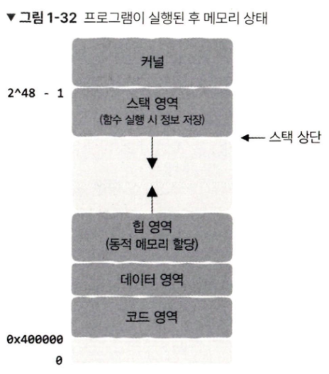

# 1. 프로그래밍 언어부터 프로그램 실행까지

## 1. 프로그래밍 언어

### 1. CPU

- 데이터를 한 곳에서 다른 곳으로 옮기고 간단하게 연산하는 **단순한** 작업만 가능
    - 하지만 **매우 빠름**!

### 2. 어셈블리어

- 기계어와 인간이 읽을 수 있는 언어를 대응시키는 변환 프로그램이 사용됨 → 어셈블리어

### 3. 저수준의 세부사항과 고수준의 추상화

- 어셈블리어는 여전히 저수준 언어
- 인간의 고수준 언어와 저수준 언어 사이의 간극을 좁히기 위한 노력이 필요함

### 4. 고급 프로그래밍 언어. 많은 규칙

- 세부사항에는 규칙 또는 패턴이 존재
- 이를 바탕으로 조건문, 매개변수, 함수 등이 탄생

### 5. 재귀

- 중첩되는 단계들을 구문이라고 칭함
- 코드는 모두 구문으로 귀결됨

### 6. 컴퓨터에게 재귀를 이해시키기

- 인간이 작성한 문제열을 컴퓨터에 이해시키는 과정을 트리로 볼 수 있음

### 7. 컴파일러

- 컴퓨터는 프로그래밍 언어를 처리할 때 구문 정의에 따라 트리 형태로 코드를 구성할 수 있다.(구문트리)
- 리프 노드의 간단한 명령어를 기계 명령어로 번역하여 그 결과를 부모 노드에 적용하는 방식으로 진행됨
- 이러한 작업을 담당하는 것을 **컴파일러** 라고 함

### 8. 해석형 언어

- 형식이 다른 CPU는 각각 자신만의 고유한 언어를 지님
- 다시 컴파일 하지 않고 여러 플랫폼에서 실행되지 위해서는?
    - 표준 명령어 집합을 정의하여 CPU의 기계 명령어 실행 과정을 모방하는 프로그램을 만든다. (여러 CPU에 상응하는 시뮬레이션 프로그램을 준비한다.)
    - 이 시뮬레이션 프로그램은 **가상 머신**이라 부름 (인터프리터)
- 컴파일러는 언어 구문에 따라 코드 구문을 분석하여 구문 트리로 만듦 → 이 구문 트리를 언어에 맞춰 기계 명령어로 번역하여 cpu에 직접 넘기거나, 바이트 코드로 변환하여 가상머신으로 넘겨 실행함
    - 실제로 컴파일러가 구문 트리를 기계 명령어로 직접 번역하진 않음
        - 바로 기계 명령어로 번역되는 것이 아니라 중간 코드(IR) 생성 등의 여러 과정을 거친다는 의미임
- 추상화될수록 세세한 제어 능력은 떨어져서 이를 위해 세부 제어가 필요한 운영 체제의 일부는 어셈블리어로 작성됨

## 2. 컴파일러

- 고수준 언어(소스 코드) → 저수준 언어(실행 파일)로 번역하는 프로그램
    - 실행 파일에는 cpu가 직접 실행할 수 있는 기계 명령어가 포함됨

### 2. 토큰 추출

- 컴파일러는 소스 코드의 항목들을 잘게 쪼갠다
    - 추가 정보는 함께 묶어 관리
    - 이러한 결합을 **토큰**이라 한다. ex. T_Keyword int (의미 + 값)
    - 컴파일러는 소스 코드 내의 모든 토큰을 찾아냄
        - 이러한 추출 과정을 **어휘 분석**이라고 함

### 3. 토큰의 의미

- 토큰 자체로는 의미가 없으며 토큰 의도를 표현해야 함
- 컴파일러가 토큰을 찾으면, 다음에는 해당 토큰을 알고 있는 상태로 기다림
- 만약 다음에 해당 토큰이 필요한 것이 아니라면 문법 오류를 보고함
- 필요하다면 정상적으로 해석을 하게 됨
- 이렇게 구문 규칙에 따라 토큰을 해석하고 트리를 생성하는 과정을 구문 분석이라 함

### 4. 생성된 구문 트리에는 이상이 없을까?

- 논리적으로 이상을 검사하는 것을 **의미 분석**이라 함
- 이를 통과하면 컴파일 오류가 없다는 것이 증명되는 것

### 5. 구문 트리를 기반으로 중간 코드 생성하기

- 의미 분석 이후, 컴파일러는 좀 더 다듬어진 형태인 중간코드(Intermediate Represenstation Code, IR Code)를 생성하게 됨
- 중간 코드에 추가적인 최적화가 진행되기도 함
    - 논리상 이상이 없는 것은 먼저 계산을 실행하는 등

### 6. 코드 생성

- 중간 코드 → 어셈블리어 코드로 변환됨
- 어셈블리어 코드 → 기계 명령어
    - CPU가 실행할 수 있게 됨
- 모든 소스 파일에는 각각의 대상 파일(object file)이 있음
    - 소스 파일이 여러 개가 되면 대상 파일이 여러 개가 되고, 이러한 대상 파일들을 하나의 실행파일로 합쳐줘야할 필요가 있음
- 대상 파일 병합 작업은 **링크**라고 불림
    - 링커라는 프로그램이 이를 담당함

## 3. 링커

- 대상 파일은 기계 명령어에 해당함
- 링커는 이러한 대상 파일을 묶어 **실행 파일을 만듦**
- 링커는 소스 코드의 **종속성**이 올바르게 설정되어 있는지 확인함
    - 인터페이스 구현이 종속된 모듈에서 사용 가능한지 확인함
    - 참조 중인 외부 심벌에 대한 실제 구현이 어느 모듈이든지 단 하나만 있는지 확인하고 이를 연결함 → 이를 **심벌 해석**이라 함
- 참조가 올바른 순서로 이루어지도록 **재배치**를 수행

### 2. 심벌 해석

- 심벌 : 전역 변수, 함수의 이름을 포함하는 모든 변수의 이름
    - 지역 변수는 모듈 내에서만 사용되기에(참조X 이기에) 링커의 관심 대상이 아님
- 링커는 해당 변수를 참조하는 대상 파일이 대상 정의가 반드시 있고, 단 하나만 있는지 확인함
- 링커가 이러한 정보를 알 수 있는 것은 컴파일러 덕분임
    - 컴파일러는 기계 명령어를 실행하기도 하지만 이 명령어를 실행시키는 데이터도 생성함
    - 따라서 대상 파일에는 중요한 두 영역이 포함됨
        1. 명령어 부분
            1. 소스 파일에 정의된 함수에서 변환된 기계 명령어가 저장됨(코드 영역)
        2. 데이터 부분
            1. 소스 파일의 전역 변수가 저장됨(데이터 영역)
            2. 로컬 변수는 프로그램 실행 시 스택 영역에서 생성되고 제거되며 대상파일에는 별도로 저장되지 않음
    - 컴파일러는 다만 전역변수가 유효하게 참조되고 있는지는 확인하지 않음 → 이는 링커의 몫
    - 하지만 아예 관련 일을 안 하는 것도 아님. 외부에서 어떤 심벌을 참조 가능한지, 어떤 외부 심벌을 참조하는 지를 기록하는 **심벌 테이블**을 제공함
        - 내가 정의한 심벌, 즉 다른 모듈에서 사용할 수 있는 심벌
        - 내가 사용하는 외부 심벌
    - 심벌 테이블도 대상 파일에 저장됨

### 3. 정적 라이브러리, 동적 라이브러리, 실행 파일

- 필요한 코드를 별도로 컴파일한 후 패치지로 묶고, 구현된 모든 함수의 선언을 포함한 것 → 헤더 파일
- 이러한 것을 **정적 라이브러리**라 함
- 소스 파일마다 단독으로 컴파일이 이루어지고 링크로 하나의 정적 라이브러리가 생성됨
- 자신의 소스 코드를 컴파일하고 실행할 때, 참조한 정적 라이브러리의 코드들은 다시 컴파일 할 필요가 없어지기에 컴파일 속도가 빨라짐
    - 이러한 과정을 **정적 링크**라고 함
    - 정적 링크는 대상 파일을 한데 모아 각각의 대상 파일에서 데이터 영역과 코드 영역을 각각 결합하는 것으로 이해할 수 있음
- 정적 링크는 라이브러리를 실행 파일에 직접 복사함
    - 표준 라이브러리를 사용하면 정적 링크로 생성된 실행 파일들은 모두 동일한 코드와 데이터의 복사본을 갖는 샘임(중복됨) → 디스크, 메모리 낭비 발생 가능
    - 이를 해결하기 위해 동적 라이브러리가 사용됨

### 동적 라이브러리

- 공유 라이브러리, 동적 링크 라이브러리라고도 불림
- 동적 라이브러리는 정적 라이브러리처럼 코드 영역, 데이터 영역 등이 포함되지만, 사용 방식과 사용 시간이 다를 뿐임
- 정적 라이브러리는 코드 영역과 데이터 영역을 모두 묶어 실행 파일에 복사함
- 반면, 동작 라이브러리는 참조된 동적 라이브러리 이름, 심벌 테이블, 재배치 정보 등 필수 정보만 실행 파일에 포함함 → 실행 파일의 크기가 줄어듦
- 이러한 필수 정보는 실행 파일에 저장됨
- 필수 정보는 동적 링크 시에 사용됨

<동적 링크 방식>

1. 프로그램이 메모리에 적재될 때 동적 링크를 진행
    1. 적재 : 실행 파일을 실행하기 위해 디스크에서 읽어 메모리의 특정 영역으로 이동시키는 과정(적재 도구라는 전용 프로세스가 실행됨)
    2. 적재 후에 적재 도구는 실행 파일이 동적 라이브러리에 의존하는지 여부를 확인할 수 있음
    3. 동적 라이브러리가 필요하면 동적 링커라는 별도의 프로세스가 실행되어 링크 과정을 수행함
    4. 동적 링크 과정이 완료되면 프로그램이 시작됨
- 이처럼  적재 중 동적 링크를 사용하려면 실행 파일이 어떤 동적 라이브러리를 참고하는 지 컴파일러에 명시적으로 알려주어야 함
1. 적재 중 고정적으로 일어나는 동적 링크 외에도 프로그램이 먼저 실행된 후, 프로그램 실행 시간(runtime) 동안 코드가 직접 동적 링크를 실행 → 실행 시간 동적 링크
    1. 실행 시간 : CPU가 프로그램을 실행한 시점부터 실행이 완료되어 프로그램이 종료된 시점까지의 시간
    2. 실행 파일이 실행될 때까지 어떤 동적 라이브러리에 의존하는지 알 필요가 없음
    3. 링크 과정을 프로그램이 실행된 이후로 미룸
    4. 실행 파일 생성 과정에 실행 파일 내부에 동적 라이브러리 정보를 저장하지 않음
    5. 그 대신, 필요 시에 특정 API를 사용하여 직접 동적으로 적재 가능

### 4. 동적 라이브러리의 장단점

<장점>

- 코드 파일이 모두 정적 라이브러리를 사용하면 그만큼 디스크 공간이 낭비되게 됨
- 동적 라이브러리를 사용하면 의존하는 프로그램 수에 상관 없이 복사본 하나만 저장되게 됨
- 때문에 공유 라이브러리 라고도 함
- 동적 라이브러리의 코드가 수정되면 해당 동적 라이브러리만 다시 컴파일하면 됨
- 플러그인 : 미리 정의된 함수를 구현하여 프로그램이 곧바로 새로운 기능을 사용하도록 함
- 여러 언어를 혼합한 개발이 가능
    - 성능이 중요한 부분은 c/c++로 작성 + 파이썬

<단점>

- 프로그램이 적재되는 시간 또는 실행 시간에 링크되기에 성능이 약간 떨어짐
- 특정 메모리 주소와 독립적으로 동작하기에 위치 독립 코드라 불림
    - 메모리에 단 하나의 복사본만 존재하고 여러 프로세스가 공유하기에, 임의의 메모리 절대 주소를 참조할 수 없음
- 적재 시에 링크를 수행하기 위해서는 종속된 동적 라이브러리, 버전 호환이 필수적임

### 5. 재배치 : 심벌의 실행 시 주소 결정하기

- 모든 변수나 함수에는 메모리 주소가 있다.
- 프로그램에 어느 메모리 주소를 확정할 지는 컴파일 시에 고려됨
- 컴파일러는 메모리에 대한 대략적인 지시만 전달함
- 나머지는 링커가 담당함
    - 컴파일러는 메모리 주소를 모르는 변수를 적어둔 파일을 생성함
- 심벌 해석 - 동일한 유형의 영역끼리 병합하는 과정
    - 대상 파일에서 각 유형의 영역이 모두 결합되면 모든 기계 명령어와 전역 변수가 프로그램 실행 시간에 위치할 메모리 주소를 결정할 수 있음
- 링커가 프로그램 실행 시마다 변경되는 메모리 주소를 인식할 수 있는 이유는 동적 라이브러리와 재배치 테이블 덕분임

### 6. 가상 메모리와 프로그램 메모리 구조

- 프로세스가 메모리에 적재되는 형태
- 메모리의 상위 주소에 스택 영역이 존재
- 그 아래에는 비어 있는 큰 공간이 존재하고
- 그 다음 힙 영역이 존재
    - malloc 함수는 힙 영역에서 메모리를 할당 받음
- 데이터 영역과 코드 영역에는 실행 파일의 내용이 메모리에 적재됨
- 프로그램이 실행되면 메모리 주소가 같은데 동일하다는 말은 아님
    - 운영 체제의 가상 메모리 덕분
- 프로그램은 자신이 독점적으로 사용하고 있다고 느끼지만 실제로는 그렇지 않음
- 링커는 명령어나 데이터가 물리 메모리에서 실제로 어디에 위치하고 있는 지를 신경쓰는 것이 아님
- → 근데 결국에는 데이터와 명령어가 물리 메모리에 저장되어야 함
    - 메모리는 페이지 단위로 관리됨
    - 맵핑 관계가 기록된 페이지 테이블은 각각의 프로세스 마다 지니고 있음
    - 하드웨어가 이 페이지 테이블을 바탕으로 가상 메모리 주소를 실제 메모리 주소로 변환함
1. 모든 프로세스의 가상 메모리는 표준화되어 있고 크기가 동일. 프로세스마다 각 영역의 크기가 다를 수는 있지만 영역이 배치되는 순서는 동일함
2. 실제 물리 메모리의 크기는 가상 메모리의 크기와는 무관함. 물리 메모리에 힙 영역, 스택 영역 등 영역 구분도 실제로는 없음. (운영 체제에 따라 다를 수는 있음)
3. 모든 프로세스는 자신만의 페이지 테이블을 지님. 같은 가상 메모리 주소여도 페이지 테이블에 따라 서로 다른 물리 메모리 주소를 획득함.

## 4. 추상화

- 추상화 → 표현력 향상. 의사소통 효율 향상. 세부 사항 보호 가능

### 1. 프로그래밍과 추상화

- 모듈로 API를 추상화하면 각각의 모듈을 사용할 때 다양하고 복잡한 내부 구현을 고민하지 않아도 됨
- 모든 프로그래밍 언어는 추상화를 지원하기 위해 각자 자신만의 작동 방식을 제공함
    - ex. 객체 지향 언어의 다형성과 추상 클래스 등

### 2. 시스템 설계와 추상화

- 컴퓨터 시스템은 기본적으로 추상화라는 기반 위에 구축됨
- CPU가 하드웨어로서 트랜지스터 여러 개로 구성되어 있지만, 명령어 집합이라는 개념으로 내부 구현 세부 사항을 보호함
    - 고급 언어로 cpu를 직접 제어할 수 있기에 프로그래밍의 질적 효용성이 높아짐
- 물리 메모리와 파일을 가상 메모리로 추상화
- 네트워크 프로그래밍은 소켓으로 추상화
    - 네트워크 패킷이 계층별로 어떻게 해석되는지, 네트워크 카드가 어떻게 데이터를 송수신하는지 신경 쓰지 않아도 됨
- 프로세스와 프로세스에 종속적인 실행 환경은 컨테이너로 추상화
    - 개발 환경과 실제 배포 환경의 차이를 걱정하지 않아도 됨
- cpu, 운영 체제, 응용 프로그램은 가상 머신으로 묶어 추상화