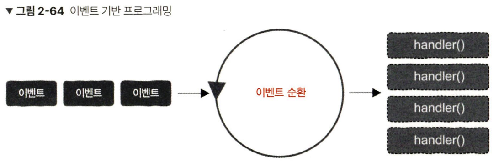
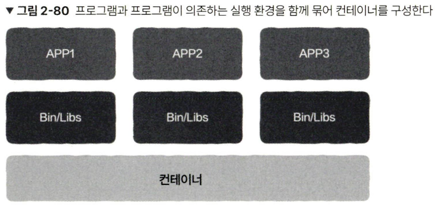

# 2.5 콜백 함수를 철저하게 이해한다

## 콜백이 필요한 이유

- 콜백 함수를 이용하여 여러 상황에 간단하게 적용할 수 있는 함수를 구성할 수 있다.
- 콜백 함수는 보통 다른 모듈이나 스레드에서 호출한다.

## 비동기 콜백

- 스레드를 이용해서 비동기적인 코드 동작을 수행할 수 있음
- 함수를 실행하고 반환을 기다리는 것 - 동기
- 비동기에서는 함수 호출 스레드와, 함수 실행 스레드가 별도로 동작한다

## 콜백 함수의 정의

- 콜백 함수 : 다른 코드에 매개변수로 전달되는 실행 가능한 코드
- 함수는 내가 작성하더라도, 이를 초뤃나느 것은 내가 참조하는 외부 모듈임
- 예) 서드 파티 라이브러리 함수 호출 시, 콜백 함수를 함께 전달하면 서드 파티 라이브러리 함수가 내가 작성한 콜백 함수를 호출함
- 서드 파티 라이브러리에서 콜백 함수를 지정해야 하는 이유 → 서드 파티 라이브러리 작성자가 특정 시기에 어떤 작업을 수행해야 하는지 알 수 없기 때문임
- 콜백 함수와 주 프로그램은 같은 애플리케이션 계층에 있지만, 우리는 해당 콜백 함수를 작성할 팩임만 있을 뿐 직접 호출하지는 않는다.
- 콜백 함수는 관심 대상인 이벤트가 발생하면 이에 대응하여 처리할 때 유용함 - 이벤트 처리 도구

## 두 가지 콜백 유형

1. 동기 콜백
    1. 블로킹 콜백
    2. 콜백 함수를 어떠한 함수에 매개변수로 전달하면, 함수가 반환되기 전에 콜백 함수가 실행되는 것 - 동기 콜백
2. 비동기 콜백
    1. 지연 콜백
    2. 마찬가지로 함수 호출에 콜백함수를 매개변수로 전달했을 때, 호출이 즉시 완료되고 일정 시간이 지나면 콜백 함수가 실행됨
    3. 주 프로그램은 이 시간 동안 다른 스레드에서 다른 작업을 수행
    4. 입출력 작업 및 동시성이 높은 시나리오에 적합

## 비동기 콜백의 문제: 콜백 지옥

- 코드의 depth가 깊어질 수 있음
- 비동기 콜백의 효율성, 동기 콜백의 코드 단순성과 가독성 → 코루틴

## 2.6 동기와 비동기 철저하게 이해하기

## 동기 호출

- 일반적인 함수 호출은 **동기** 방식임 - 동일한 스레드
- 입출력과 시스템이 동기이지만 다른 스레드 - 블로킹 입출력
- 즉, 동기는 같은 스레드 여부가 중요한 것이 아님

## 비동기 호출

- 일반적으로 디스크 읽고 쓰기, 네트워크 송수신 등 시간이 많이 걸리는 입출력 작업을 백그라운드 형태로 실행
- 호출된 작업의 완료 여부를 아는 방법

<상황>

1. 호출자가 실행 결과를 전혀 신경 쓰지 않을 때
2. 호출자가 실행 결과를 반드시 알아야 할 때

- 첫 번째 상황
  - 콜백 함수
  - 호출자 스레드가 아닌 콜백 함수가 실행되는 다른 스레드 또는 프로세스 등에서 처리
- 두 번째 상황
  - 알림 작동 방식
  - 작업 실행 완료 시 호출자에게 작업 완료를 알리는 신호나 메시지를 보냄
  - 결과 처리는 마찬가지로 호출 스레드에서 작업
  - 호출자가 하나의 스레드를 사용하고 실제 작업은 일반적으로 다른 스레드에서 실행

- 일반적으로 입출력이 있는 데이터베이스 작업에서는 멀티 스레드로 블로킹 작업이 이루어짐
  - 이로 인해 주 스레드 가운데 빈 공간, 즉 유휴시간이 생김
  - 따라서 이를 활용하기 위한 비동기 방식이 고안됨
    - 비동기는 효율적이고 빠르지만, 비교적 이해하기 어렵고, 시스템 유지 보수가 번거롭다는 단점이 있음

<상황>

1. 주 스레드가 데이터베이스 처리 결과를 전혀 신경 쓰지 않을 때
    1. 데이터베이스 스레드가, 자신의 영향을 받는 작업들까지 처리함
    2. 데이터베이스 스레드는 자신의 영향을 받는 작업들을 알기 위해 콜백 함수를 사용함
2. 주 스레드가 데이터베이스 작업 결과에 관심을 가질 때
    1. 데이터베이스 스레드는 알림 작동 방식을 통해 작업 결과를 주 스레드로 전송해야 함
    2. 주 스레드는 데이터베이스 호출을 기다리는 동안 자신이 할 일을 하다가, 호출이 오면 데이터 베이스 작업을 우선적으로 처리하고 다시 자신이 할 일을 함
    3. 유휴 시간이 없기에 동기보다는 여전히 요율 적

## 2.7 블로킹과 논블로킹

- 동기는 a,b라는 두 대상이 강하게 결합된 것(의존)
- 비동기는 a,b가 강한 결합같은 제약이 없어 각자 자신의 작업을 실행할 수 있음(독립적)

## 블로킹과 논블로킹

- a가 b호출할 때, b를 호출함과 동시에 운영 체제가 a가 **실행 중인 스레드나 프로세스를 일시 중단**시키면 → 블로킹
  - 일시 중단 안 시키면 → 논블로킹

## 블로킹의 핵심 문제: 입출력

- 운영 체제는 cpu의 리소스를 최대한 활용할 수 있도록 각 스레드 간에 cpu 사용 시간을 효율적으로 할당해야 함 → 블로킹 입출력 방식이 필요한 핵심적인 이유
  - 시간이 많이 걸리는 입출력 작업에서 블로킹이 발생하여 일시 중단이 발생 → 느려짐
  - 호출 스레드를 일시 중단하지 않으면서 입출력 작업을 시작하는 방법 → 논블로킹 호출

## 논블로킹과 비동기 입출력

- 동시 동작하는 스레드 간 데이터 수신 여부를 아는 방법
    1. 논블로킹 방식 외에 결과를 확인하는 함수를 함께 제공하고, 해당 함수를 호출하여 수신된 데이터가 있는지 확인할 수 있음
    2. 데이터가 수신되면 스레드에 메시지나 신호 등을 전송하는 알림 작동 방식을 사용
    3. 논블로킹 함수를 호출할 때, 데이터 수신 처리를 담당하는 함수를 콜백 함수에 담아 매개변수로 전달할 수 있음
- 이것들이 논블로킹 호출이며, 이러한 입출력 작업을 비동기 입출력이라고 함

## 동기와 블로킹

- 다소 유사
- 동기 호출은 반드시 블로킹은 아니지만, 블로킹 호출은 모두 확실한 동기 호출임

## 비동기와 논블로킹

- 네트워크 에서는 논블로킹 설정값을 통해 구현 가능
  - 네트워크 데이터를 처리해 주는 Handler 함수를 콜백으로 전달해야 함
- 계속 수신을 대기하는 식으로 구현하면 논블로킹이지만 동기인 코드가 됨

## 2.8 높은 동시성과 고성능을 갖춘 서버 구현

## 다중 프로세스

- 병행 처리 방식의 일종

<장점>

1. 프로그래밍이 간단하여 이해하기 쉬움
2. 개별 프로세스의 주소 공간은 서로 격리되어 있기에 하나의 프로세스에 문제가 발생하여 강제 종료되더라도 다른 프로세스에는 영향을 미치지 않음
3. 다중 코어 리소스를 최대한 활용할 수 있음

<단점>

1. 프로세스 간 주소 공간 격리는 통신 난이도를 높이고, 프로세스의 통신 작동 방식을 사용해야 함
2. 프로세스를 생성할 때 부담이 상대적으로 크고, 프로세스의 빈번한 생성과 종료는 시스템 부담을 증가시킴

## 다중 스레드

- 프로세스 생성 부담과 프로세스 간 통신의 어려움을 해결
- 스레드는 프로세스 주소 공간을 공유하기에 별도의 통신 작동 방식이 필요 없음
- 스레드 안전이 보장된다는 전제 하에 메모리를 직접 읽어서 데이터를 얻을 수 있음
- 스레드 일부의 일시중지는 서로 영향 받지 않음

<단점>

1. 스레드는 서로 같은 주소 공간을 공유하기에 하나의 스레드에 문제가 발생하여 강제 종료되면 같은 ㅍ로세스를 공유하는 모든 스레드와 프로세스가 한꺼번에 강제 종료됨
2. 여러 스레드가 동시에 공유 리소스의 데이터를 읽고 쓸 수 없음
   1. 동기화 시 상호 배제 같은 작동 방식 필요

- 스레드 생성 부담이 프로세스보다 적기는 하지만 아예 부담이 없지는 않음
  - 대규모 트래픽에서는 부담임

## 이벤트 순환과 이벤트 구동

- 이벤트 기반 동시성을 이용한 이벤트 기반 프로그래밍

<구성>

1. 이벤트
    1. 대부분 입출력에 관계됨
    2. 네트워크 데이터의 수신 여부, 파일의 읽기 쓰기 가능 여부 등 관심 대상
2. 이벤트를 처리하는 함수
    1. 일반적으로 이벤트 핸들러라고 함

- 이벤트 순환은 이벤트의 도착을 기다렸다가 대응하는 이벤트 핸들러를 호출하면 됨

## 이벤트 소스와 입출력 다중화

- 리눅스와 유닉스에서는 모든 것이 파일로 취급됨
- 프로그램은 모두 파일 서술자를 사용하여 입출력을 실행하며 소켓도 마찬가지.
- 동시에 파일 서술자 여러 개를 처리하려면?
- 입출력 자동화(리눅스의 epoll)
- 입출력 다중화 기술이 이벤트 순환의 엔진이 되어 지속적으로 다양한 이벤트를 제공함

## 이벤트 순환과 다중 스레드

- 간단하고 빠르게 처리가 가능한 이벤트는 이벤트 핸들러와 이벤트 순환을 동일한 스레드에서 실행할 수 있음
  - 이 경우 모든 요청이 단일 스레드에서 순차적으로 처리됨
- 이벤트가 많거나 오래 걸릴 경우에는 다중 코어로 최대한 빠르게 처리하기 위해 다중 스레드가 필요함
  - 이벤트 순환과 핸들러를 다른 스레드에 배치함
  - 시스템의 다중 코어를 최대한 활용하여 요청 처리를 가속화할 수 있음
  - 작업자 스레드를 스레드 풀로 구현하는 것도 가능
  - 이러한 설계 방법을 반응자 패턴이라고 함

## 반응자 패턴

- 수신자를 두고, 작업자를 여러 두어 운영하는 방식을 반응자 패턴이라 함

## 이벤트 순환과 입출력

<상황>

1. 입출력 작업에 대응하는 논블로킹 인터페이스가 있는 경우
    1. 논블로킹 인터페이스 호출 시 스레드가 일시 중지되지 않으며, 인터페이스가 즉시 반환됨
    2. 이벤트 순환에서 직접 호출하는 것이 가능
2. 입출력 작업에 블로킹 인터페이스만 있는 경우
    1. 이벤트 순환 내에서 절대로 어떤 블로킹 인터페이스도 호출하면 안됨!!
        1. 이벤트 순환 스레드가 일시 중지될 수 있으며 전체 중지로 이어짐
    2. 따라서 블로킹 입출력 호출이 포함된 작업은 작업자 스레드에 전달해야 함
        1. 그래야지 다른 작업자 스레드에 문제 안 생김

## 비동기와 콜백 함수

- 서버는 일반적으로 원격 프로시저 호출(RPC)을 통해 통신함
- RPC 호출들은 모두 블로킹 호출이기 때문에 사용자가 응답하기 전에는 함수가 반환되지 않음
- 동기 작업으로 대기시간 증가 → 많은 작업자 스레드를 사용하는 것은 리소스에 부담이 됨
  - 비동기 호출을 이용
  - RPC 호출 시 처리할 내용을 콜백함수에 포함시킴
  - 하지만 이렇게 하면 코드의 관리가 너무 복잡해짐
  ⇒ 비동기의 효율성과 동기의 단순성을 결합한 코루틴!

## 코루틴: 동기 방식의 비동기 프로그래밍

- 핸들러 함수 코드 구현은 동기
- 하지만 yield로 cpu 제어권을 반환하는 등 rpc 통신이 시작된 후 적극적으로 바로 호출됨
  - rpc 호출 함수 또는 네트워크 데이터 전송 함수를 수정해야 yield로 cpu 제어권을 반환할 수 있음
- 블로킹이지만 코루틴이 중단되어도 작업자 스레드는 블로킹되지 않음
- 코루틴이 일시 중지되면 작업자 스레드는 준비 완료된 다른 코루틴을 실행하기 위해 전환됨
- 이로써 동기 방식으로 프로그래밍 하더라도 비동기 실행과 같은 효과를 얻을 수 있음
- 비록 코루틴이 블로킹 방식으로 rpc 호출을 하더라도 작업자 스레드는 블로킹되지 않기 때문에 시스템 리소스를 효율적으로 사용할 수 있음

## CPU, 스레드, 코루틴

- CPU : 기계 명령어를 실행하여 컴퓨터를 움직이게 함
- 스레드(커널 상태 스레드)
  - 커널로 생성되고 스케줄링을 함
  - 커널은 스레드 우선순위에 따라 cpu 연산 리소스를 할당함
- 코루틴(사용자 상태 스레드)
  - 코루틴은 커널이 알 수 없으며 상관이 없음

## 2.9 컴퓨터 시스템: 데이터, 코드, 콜백, 클로저에서 컨테이너, 가상 머신까지

## 코드, 데이터, 변수, 포인터

- 메모리는 코드로 구성된 명령어 외에 명령어가 작동하는 데 필요한 데이터도 저장할 수 있음
- 데이터 종류가 아니라 별칭을 사용하여 데이터를 지칭할 수 있음

## 콜백 함수와 클러저

- 하나의 코드를 여러 개의 변수가 참조할 수 있음
- 특정 언어에서 일반 변수를 다루듯이 처리할 수 있을 때 이 언어 함수를 일급 객체 함수라고 함
- 함수가 다른 함수에 매개변수로 전달될 때 해당 함수를 콜백 함수라고 함
- 클로저 : 콜백 함수를 일부 데이터와 묶어 변수를 취급하는 것

## 컨테이너와 가상 머신 기술

- 어떤 함수가 cpu를 능동적으로 일시 중지하고 다음에 함수가 다시 호출될 때 앞에서 중단된 지점에서 계속 실행하는 것이 가능할 때 이 함수 → **코루틴**
- 함수의 일시 중지와 재개가 커널 상태에 구현되는 것 → **스레드**
- 스레드에 주소 공간처럼 종속된 실행 시 리소스를 결합한 것 → 프로세스
- 라이브러리처럼 프로그램이 의존하는 실행 환경과 함께 묶인 것 → 컨테이너

- 컨테이너는 일종의 가상화 기술로서 **운영 체제를 가상화**함
- 컨테이너에 포함된 프로세스는 전체 운영 체제 안에 자신의 프로세스만 존재하고 있다고 간주하게 됨
- 컨테이너는 운영 체제 계층 수준에서 소프트웨어 리소스를 가상화 함
- 하드웨어 리소스까지 가상화할 수 있으며 이러한 작업은 가상 머신 감시자가 수행함 → 하이퍼바이저
- 가상 머신 감시자에서 실행되는 운영 체제를 가상 머신이라 함
