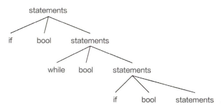
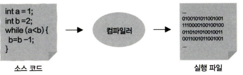
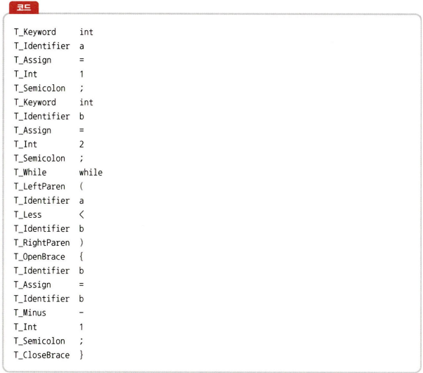
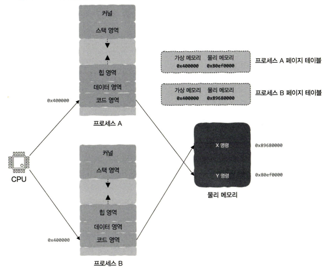

# 1장 프로그래밍 언어부터 프로그램 실행까지, 이렇게 진행된다

> 프로그래머가 코드를 작성할 때 어떤 일이 일어나는가?

# 1.1 여러분이 프로그래밍 언어를 발명한다면?

### 부제: 프로그래밍 언어에 대해서

처음에는 CPU가 알기 위한 0과 1의 조합으로 코드 작성하였다.

추후에 발전하여 기계어와 해당 특정 작업을 간단하게 대응시켜 기계어를 인간이 읽고 이해할 수 있는 단어와 대응 시킨 어셈블리어가 등장하였다.

아직 저수준 언어(Low-level language)에 머물러 있는 상황
그 저수준 언어에서 반복적인 규칙형태를 발견하였고 그 반복적인 형태를
CPU가 이해할 수 있게 추상화하는 방법을 고민하였고, 나온 것이 규칙을 인간이 사용하는 언어(문장)로 표현해보기 위해 if else, for while 등 고급 프로그래밍 언어가 등장하기 시작함

하지만 그 조건, 순환 안에 또다른 조건, 순환, 함수 호출 등이 발생할 수 있어서 끊임없는 자식-손자 관계가 발생 할 수 있었으나 

끝없이 중첩된 것을 수열처럼 재귀로 표현할 수 있다는 사실을 발견함

그렇다면 위와 같이 조건, 순환, 함수 호출, 재귀 등을 컴퓨터가 이해하도록 만드는 방법은?
-> 트리 구조로 표현이 가능해짐

이제 리프 노드를 기계 명령어로 번역하면 그 결과를 리프 노드의 부모 노드에 적용할 수 있게 되고 그것을 반복하면 전체 구문트리를 기계 명령어로 번역이 가능해짐

정리해서 고급 프로그래밍 언어를 사용해서 코드를 작성한 것을 CPU가 인식할 수 있는 기계 명령어로 번역하는 역할이 바로 컴파일러이다.
-> 하지만 컴파일러 역시 설명처럼 구문 트리를 기계 명령어로 직접 번역하진 않는다.

세상에 다양한 CPU가 존재하는데 각각의 CPU가 사용하는 고유한 언어가 다르다
Arm, x86 끼리의 플랫폼 끼리의 호환성 문제처럼 말이다.

하지만 직접 표준 명령어 집합을 정의해서 CPU의 기계 명령어 실행 과정을 모방하는 프로그램을 작성하여 사용하는, CPU마다 상응하는 시뮬레이션 프로그램을 만들면 코드가 서로 다른 플랫폼에서 실행 시킬 수 있습니다.

이 시뮬레이션 프로그램을 가상 머신(Virtual machine)이라는 이름을 붙였다.

# 1.2 컴파일러는 어떻게 작동하는 것일까?

### 컴파일러의 작동 원리에 대해서..

> 컴파일러 : 고수준 언어를 저수준 언어로 번역하는 프로그램

쉽게 생각해서 밑의 그림과 같이 고수준 언어로 구성된 소스 코드를 컴파일러라는 프로그램을 통해서 기계가 알아들을 수 있는 저수준 언어로 구성된 실행 파일로 "번역" 시켜준다.

**컴파일러가 하는 작업**
- 소스 코드를 돌아다니면서 모든 토큰을 찾아냄 - 어휘 분석(lexical analysis)

- 구문에 따라서 토큰을 처리하여 해석한 구조를 구문 트리로 표현 - 해석(parsing)

- 구문 트리가 생성되고 이상이 없는지 확인 - 의미 분석(semantic analysis)

- 구문 트리를 탐색한 결과를 바탕으로 중간 코드(IR Code)를 생성

- 중간 코드 생성이 완료되면 어셈블리어 코드로 변환

- 어셈블리어 코드를 CPU가 실행할 수 있는 기계 명령어로 변환

**링크(link), 링커(linker)**
컴파일 과정을 거쳐 생성된 대상 파일(object file / .o 확장자 파일)이 여러 개가 생성된다면 이 여러 개의 대상 파일을 하나의 실행 파일로 합쳐주는 무엇인가가 필요하다

이 때 대상 파일을 병합하는 작업 그 자체를 링크(link)라고 표현하며 이 링크를 담당하는 프로그램을 링커(linker)라고 한다.

# 1.3 링커의 말할 수 없는 비밀

> 링커 : 컴파일러가 생성한 대상 파일 여러 개를 하나로 묶어 하나의 최종 실행 파일을 생성합니다.

1. 오브젝트 파일 결합

컴파일러가 각 소스 파일을 독립적으로 컴파일하여 생성한 오브젝트 파일들을 하나의 실행 파일로 합침

2. 심벌(Symbol) 해석 (심벌 : 전역 변수와 함수의 이름을 포함하는 모든 변수의 이름)

코드에서 사용된 함수, 전역 변수 등의 심벌을 찾아 실제 메모리 주소를 할당
예를 들어, printf() 같은 함수는 C 표준 라이브러리에 정의되어 있으므로, 이를 적절한 라이브러리에서 찾아 연결

3. 라이브러리 결합

정적 라이브러리(.a, .lib) 또는 동적 라이브러리(.so, .dll)를 오브젝트 파일과 함께 결합
정적 라이브러리는 실행 파일에 포함되며, 동적 라이브러리는 실행 시 필요

4. 재배치(Relocation) 처리

각 모듈이 참조하는 주소를 실제 메모리 주소로 변환하여, 실행 가능한 바이너리를 생성

링커가 다른 모듈에서 참조 해야할 심벌이 존재하는지, 그 심벌이 다른 모듈에 정의 되어있는지 아는 방법은? -> 컴파일러가 알려줌

컴파일러가 대상 파일을 생성할 때 기계 명령어와 그 명령어를 실행시키는 데이터도 생성함 따라서 대상 파일에 중요한 두 가지 영역이 포함되어있음

- 명령어 부분 : 기계 명령어가 저장되는 부분 (코드 영역)
- 데이터 부분 : 전역 변수가 저장되는 부분 (데이터 영역)

컴파일러는 외부의 전역 변수, 함수를 발견하면 실제로 정의되었는가를 판단하지 않고 링커에게 넘기게 됨 하지만 그 사이에 소스 파일마다 외부에서 참조 가능한 심벌이 어떤 것인지 기록하고 어떤 외부 심벌을 참조하는지 기록해두는데 이 기록한 표를 심벌 테이블 이라고 함

심벌 테이블에는 1. 내가 정의한 심벌 2. 내가 사용하는 외부 심벌 두 가지로 표시하고
이 심벌 테이블을 대상 파일에 코드 영역, 데이터 영역과 함께 저장시킴

이 심벌 테이블의 정보를 통해서 링커가 심벌 해석하는 과정을 쉽게 거칠 수 있음

> 정적 라이브러리, 동적 라이브러리, 실행 파일

실행 파일을 만들기 위해선 링커는 정적 라이브러리 또는 동적 라이브러리를 사용함

- 정적 라이브러리 
컴파일 시 실행 파일에 포함됨
실행 시 추가 적인 라이브러리가 필요없고 외부 코드를 매번 컴파일하지 않아도 되어 빠름 (정적 링크 - 대상 파일을 모아 각 대상 파일의 영역들을 결합)

단점 
라이브러리 전체를 항상 포함하기에 실행 파일의 크기가 커져서 메모리, 디스크 낭비
라이브러리 자체를 수정하면 실행 파일을 처음부터 다시 빌드해야함

- 동적 라이브러리
컴파일 시 포함되지 않고 실행 시 로드 됨 (동적 링크)
참조 된 동적 라이브러리 이름, 심벌 테이블, 재배치 정보 등 필요한 정보만 실행 파일에 포함
실행 파일 크기 자체가 작아질 것이며 라이브러리를 수정해도 다시 빌드하지 않아도 됨
플러그인
코드 재사용성

단점
실행마다 항상 라이브러리가 필요하며, 라이브러리 의존성 문제가 발생
임의의 메모리 절대 주소로 참조 불가

동적 링크는 두 가지 방식으로 실행되는데
프로그램이 메모리에 적재(loading)될 때, 런타임 동안 코드가 직접 동적 링크 실행

- 링커의 재배치 기능
링커는 실행 파일을 생성할 때 프로그램이 실행되는 시점에 적재될 메모리 주소를 확정해야함
컴파일러는 어떤 메모리 주소에 넣어야하는지 알 수 없기에 그런 변수를 발견할 때마다
.relo.text에는 그 명령어를 저장, .relo.data에는 명령어와 관련된 데이터를 저장함
링커는 위 정보를 가지고 수정을 해야함 -> 재배치(relocation)

이 때 링커가 변수의 실행 시간 메모리 주소를 미리 알아내는 방법 - 가상 메모리(virtual memory)

가상 메모리는 각 프로그램이 실행 중일 때, 자신이 모든 메모리를 모두 독점하고 있다고 착각하는 기술이며 이 기술로 메모리 구조는 항상 같기에 실행 시 심벌의 메모리 주소를 확인 가능함

하지만 결국 실행 파일을 시키려면 물리 메모리에 적재 되어야만 하는데 이때 가상 메모리와 물리 메모리 주소를 연결하는 사상(mapping) 관계가 추가된다.

사상 관계를 기록한 표를 페이지 테이블 이라고하며 밑의 그림과 같이 페이지 테이블을 이용해서 사상 관계를 찾아 가상 메모리에서 물리 메모리 주소로 변환하여 접근함

# 1.4 컴퓨터 과학에서 추상화가 중요한 이유

프로그래밍 추상화 - 모듈 기반 설계같은 경우 각 모듈이 간단한 API를 추상화하면 필요한 모듈을 사용할 때 추상화된 API만 집중가능해짐

CPU - 기계 명령어를 고급 프로그래밍 언어로 추상화하여 CPU를 직접 제어함

입출력 장치 - 파일로 추상화

실행 중인 프로그램 - 프로세스로 추상화

물리 메모리,파일 - 가상 메모리로 추상화

네트워크 프로그래밍 - 소켓으로 추상화

프로세스와 그 종속된 실행 환경 - 컨테이너로 추상화

CPU, 운영 체제, 애플리케이션 - 가상 머신으로 묶여 추상화

결론 : 추상화는 프로그래머를 저수준 계층에서 멀어지게하여 세부 사항을 신경 덜 쓰게 해줌

# 1장 전체적인 요약

CPU는 기계 명령어만 실행함 -> 컴파일러가 번역기 역할을 해서 고급 프로그래밍 언어 문법 코드를 구문 분석을 해서 기계 명령어 생성 -> 이때 프로그래머가 기계 명령어를 알지 못해도 CPU를 세부 사항에서 보호하여 프로그래밍이 가능하게 해주는 추상화가 있음 -> 마지막으로 링커가 모든 코드와 데이터, 라이브러리를 묶어 실행 파일을 생성함

1장은 CPU에게 명령해서 일을 시켜서 실행 파일을 생성하는 부분까지 진행이 된 느낌이다.