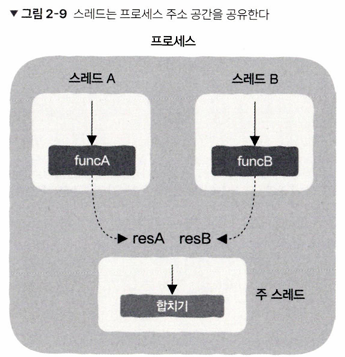

# 2장장 프로그램이 실행되었지만, 뭐가 뭔지 하나도 모르겠다

> 프로그램의 실행 시간 동안 일어나는 일들

# 2.1 운영 체제, 프로세스, 스레드의 근본 이해하기

CPU는 1. 명령어 인출 2. 명령어 실행 이 두 가지의 과정만 알고 반복한다.

프로세스나 스레드 같은 게 무엇인지 알지 못한다.

그럼 어떤 기준으로 메모리나 명령어를 가져오는가? -> 프로그램 카운터(PC 레지스터)
PC 레지스터에는 메모리에 저장된 명령어 주소를 저장하는데 이 주소를 통해서 CPU가 명령어를 실행시킴

### 프로세스가 발명되는 과정, 운영 체제의 탄생

CPU가 프로그램을 실행 하려면?
실행 파일을 수동으로 메모리에 복사한 후 main 함수의 기계 명령어를 메모리에서 찾아 PC 레지스터에 적재한다.
-> 수동으로 하면 여러가지의 단점 존재(한 번에 하나만 가능 등)

CPU가 어떤 기계 명령어 실행했는지, 내부 기타 레지스터 값 등의 상태(상황 정보)를 저장해두고 프로그램 실행을 중지, 실행을 마음대로 하게 하는 구조체를 작성함
-> 이 구조체에 프로세스라는 이름을 붙임

프로세스를 사용하면 CPU가 하나뿐인 시스템에도 수많은 프로세스를 동시 실행하게 하거나 보이게 할 수 있음

이러한 프로그램 도구들의 이름 -> 운영 체제

프로그램이 실행 중일 때 메모리 내 해당 프로세스의 상황
- 프로세스 주소 공간간

- 코드 영역(code segment): 코드를 컴파일하여 생성된 기계 명령어 저장
- 데이터 영역(data segment): 전역 변수 등
- 힙 영역(heap segment): malloc 함수가 요청을 반환한 메모리가 여기 할당됨
- 스택 영역(stack segment): 함수의 실행 시간 스택

다중 프로세스 프로그래밍(multi-process programming)

위 그림 예시로 funcA, funcB를 각각 프로세스 A, B에 넣고 결과를 얻은 후 프로세스 B의 결과를 A에 전달하여 더 함 
- B에서 A로 전달할 때 통신 문제가 발생 가능함
- 프로세스 생성 시 오버헤드가 생김
- 프로세스마다 자체적인 주소 공간을 가져서 프로세스간의 통신은 더 복잡함

이 단점들을 없애기 위해 "스레드"가 나오게 됨

### 프로세스에서 스레드로 진화

하나의 프로세스 안에서 여러 실행 흐름이 존재할 수 있다.
이 실행 흐름 단위를 스레드(thread)라는 이름을 붙힘 -> CPU가 진입 함수에서 실행을 시작하여 하나의 실행 흐름의 생성할 때의 "실행 흐름"을 스레드라고 얘기함함

스레드는 동일한 하나의 프로세스 주소 공간에 속해 있기 때문에 동일한 프로세스 내에 있는 모든 스레드는 변수들을 직접 사용이 가능해짐 -> 스레드는 자신이 속해 있는 프로세스의 주소 공간을 공유한다. (경량 프로세스라고도 불림)

주의
- 다중 코어가 있어야만 다중 스레드를 사용할 수 있는건 아니다 
-> 단일 코어도 가능, 스레드는 운영 체제 계층에 구현되며 코어 개수와는 무관하다

모든 스레드는 각자 자신만의 스택 영역을 가지고 스레드가 이를 인지하고 있음
-> 스레드를 생성하면 프로세스의 메모리 공간이 소모된다를 알 수 있고, 같은 프로세스의 스레드는 코드, 데이터, 힙 영역을 공유하지만 스택은 개별적으로 할당이 됨

결론 : CPU의 PC 레지스터에 스레드의 진입 함수 주소를 지정하면 스레드를 실행시킬 수 있다.

### 스레드 풀(thread pool)
- 스레드 여러 개를 미리 생성하고 처리할 작업이 생기면 해당 스레드에 요청하는 것
- 작업이 끝나면 스레드를 삭제하지 않고 재사용함

스레드 풀의 동작 방식
1. 프로그램 시작 시 일정 개수의 스레드를 생성하여 풀에 보관
2. 작업이 요청되면 대기 중인 스레드가 즉시 실행
3. 모든 스레드가 사용 중이면 작업이 대기열(Queue)에 저장
4. 작업이 끝난 스레드는 풀로 돌아가서 새로운 작업을 기다림

스레드 풀의 스레드 수는 구체적인 상황과 분석을 통해서 결정해야함

# 2.2 스레드 간 공유되는 프로세스 리소스

> 다시 한번 외워두는 정석적인 개념 - 프로세스와 스레드의 차이점
프로세스 : 운영 체제가 리소스를 할당하는 기본 단위
스레드 : 스케줄링의 기본 단위 
프로세스 리소스는 스레드 간에 공유된다.

스레드 전용 리소스 : 스레드 상황 정보 (스레드 스택 영역, 프로그램 카운터, 스택 포인터, 함수 실행시 사용되는 레지스터 정보)

이 스레드 상황 정보를 제외하고 나머지는 스레드 간에 공유되는 리소스임

스레드 부록

주의 : 하나의 프로세스 안에 여러 개의 스레드가 존재하면 그 스레드끼리는 다른 스레드의 스택 영역이라도 모두 데이터를 읽고 쓰는게 가능해짐 
프로세스 내의 모든 스레드는 동적 라이브러리의 코드와 데이터를 사용 가능함

# 2.3 스레드 안전 코드는 도대체 어떻게 작성해야 할까?

> 스레드 안전이 무엇인가? thread safety를 어떻게 달성하는가

스레드 안전 달성 조건
- 전용 리소스를 사용하는 스레드
- 공유 리소스를 사용하는 스레드는 다른 스레드에 영향을 주지 않도록 하는 조건에 맞게 사용

스레드 안전?
-> 어떤 코드가 주어질 때 그 코드가 스레드 몇 개에서 호출되든 올바른 결과가 나오는 것 즉 단일 스레드든 다중 스레드든 실행결과가 올바르다는 것은 스레드 안전코드이다.

스레드 안전의 핵심 -> 어떤 것이 스레드 전용 리소스이고 공유 리소스인지 구분하는 것

스레드 공유 리소스
- 힙 영역: 메모리의 동적 할당에 사용되는 영역 (C/C++ 언어의 malloc 함수, new 예악어가 요청하는 메모리가 이 영역에 할당됨)
- 데이터 영역: 전역 변수가 저장되는 영역
- 코드 영역 -> 이 부분은 읽기 전용이어서 코드 수정이 불가하기에 신경 쓰지 않아도 됨

그럼 스레드 공유 리소스는 주로 힙 영역과 데이터 영역으로 구성된다는걸 알 수 있음

공유 리소스를 사용하는 순서의 핵심은 사용하고 있는 스레드가 있다면 다른 스레드가 방해할 수 없다 -> 뮤텍스 락, 세마포어 같은 장치를 사용 가능 - 공유 리소스의 순서 유지가 목적

스레드 안전을 달성 하기 위한 각 상황 마다의 대처
- 스레드 전용 저장소(thread local storage): 전역 리소스 사용 시 스레드 전용 저장소로 선언 할 수 있는가?
- 읽기 전용(read-only): 전역 리소스를 반드시 사용해야한다면 읽기 전용으로 사용해도 되는가?
- 원자성 연산(atomic operation): 원자성 연산은 도중에 중단 되지 않아서 잠금이 필요 없음
- 동기화 시 상호 배제(mutual exclusion in synchronization): 한 번에 하나의 스레드만 공유 리소스에 접근할 수 있도록 스레드가 접근하는 공유 리소스 순서를 개발자가 직접 유지해야하는 상황 -> 이때 뮤텍스, 세마포어 등의 방식을 사용할 수 있음

증상을 파악하고 그 증상에 맞는 대처를 하는 프로그래머가 되기 위해 위의 상황 마다의 대처를 기억해두는게 중요할 것 같다.

# 2.4 프로그래머는 코루틴을 어떻게 이해해야 할까?
> 동시성이라는 단어에 대해 잘 이해해보자

### 코루틴 이란?
함수 실행을 중간에 멈췄다가 다시 이어서 실행 가능한 함수 / 즉, 자신이 이전에 마지막으로 실행된 위치를 알 수 있는 함수

마치 운영 체제가 스레드를 스케줄링하는 것과 똑같음

코루틴은 힙 메모리를 이용하게 됨 -> 힙은 필요할 때 직접 할당 및 해제가 가능하여 동적 메모리 할당, 실행 상태 유지에 적합하기 때문에 코루틴이 힙 메모리에 저장하는게 적합함 (스택 프레임은 함수가 종료되면 자동으로 해제되기 때문에 실행 상태 유지가 불가능)

코루틴의 중요한 역할? 왜 쓰는가?
동기, 비동기 방식의 프로그래밍에 적용이 가능함함