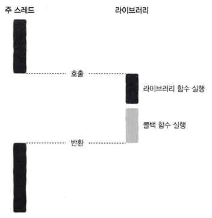
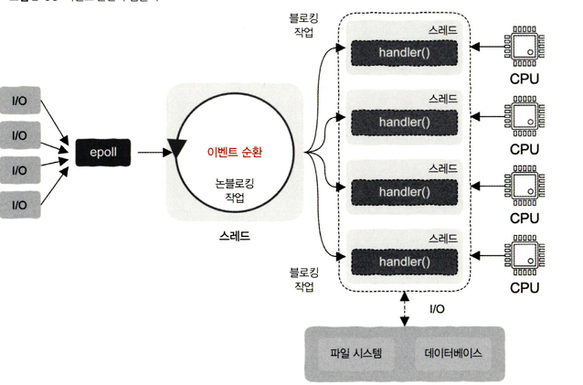

2.5 ~ 2.10

# 2.5 콜백 함수를 철저하게 이해한다.

> 콜백 함수의 개념과 그것이 "왜" 필요한가?

콜백 함수 : 다른 함수에 매개변수로 전달되어 특정 시점에 실행되는 함수
어떤 작업이 끝난 후 실행될 함수를 미리 등록해놓는 개념이라고 생각했다.

콜백 함수가 "왜" 필요한가? -> 비동기 처리, 재사용성, 코드의 순서 제어 가능

특히 비동기 처리에 콜백 함수를 사용하면 작업이 끝났을 때 자동으로 실행되게 할 수 있다.
이것을 비동기 콜백이라고 부른다.

책에서는 비동기 콜백이 각자의 스레드에서 병렬로 실행될 수 있다고 했지만,
이 실행 방식은 프로그래밍 언어, 환경(싱글, 멀티 스레드)에 따라 달라집니다.

예를들어 자바스크립트의 경우 싱글 스레드 언어이고, 비동기 작업(파일 읽기, 네트워크 요청 등)은 백그라운드(Web API, Worker Thread 등)에서 실행되고, 완료 후 이벤트 루프를 통해 콜백이 실행이 됩니다.

자바, 파이썬 같은 멀티스레드 환경에서는 각 스레드가 독립적으로 실행되면서 병렬 처리될 수 있다.

정리하자면..
# 싱글스레드 환경에서는 비동기 작업을 백그라운드에서 실행하지만,
# 멀티스레드 환경에서는 각 스레드가 독립적으로 실행되어 병렬 실행

동기 콜백, 비동기 콜백의 차이를 그림으로 이해하자!

비동기 콜백의 문제점
비동기 작업이 중첩되면 코드의 깊이가 점점 깊어져서 가독성이 떨어지고 유지보수가 어려워져.

(콜백 지옥 예제)
getUserData(userId, (user) => {
    getOrders(user, (orders) => {
        getOrderDetails(orders[0], (details) => {
            processPayment(details, (payment) => {
                console.log("결제 완료!", payment);
            });
        });
    });
});

### 2.6 동기와 비동기를 철저하게 이해한다.

기존에 알던 동기, 비동기의 개념보다 스레드 관점에서의 동기, 비동기를 이해해보자.

동기(Synchronous)
"한 개의 스레드에서 실행되다가, 다른 작업을 요청하면 기존 스레드는 멈추고, 요청한 작업이 끝나야 다시 실행되는 방식"

비동기(Asynchronous)
"작업을 요청한 후 기다리지 않고 바로 다음 작업을 실행하고, 요청한 작업이 끝나면 완료되었다고 콜백을 통해 알려주는 방식"

동기는 하나의 스레드가 정지되고 다른 작업을 실행하는 느낌이고,
비동기는 요청한 후 정지하지 않고 다른 작업을 진행하다가, 완료되면 알려주는 느낌

동기와 비동기의 웹 서버 관점에서 비교하면 다음과 같다.

### 2.7 블로킹과 논 블로킹도 있다.

블로킹(blocking), 논블로킹(non-blocking)은 프로그래밍에서 함수 호출할 때 주로 사용이 됩니다. 
블로킹 방식 : 함수 A가 B를 호출할 때, OS가 함수 A가 실행 중인 스레드나 프로세스를 일시 중지 시키는 방식
이 반대는 논블로킹 방식

시간이 많이 걸리는 입출력 작업이 포함될 때 가끔 호출 스레드가 블로킹되며 일시 중지 되는 일이 발생하는 경우가 있음.

논블로킹 호출을 사용하면 해결 가능함.
- I/O 요청을 보낸 후, 완료 여부와 관계없이 즉시 다음 작업을 수행하는 방식
- I/O 요청을 보내고 기다리지 않고 즉시 다음 코드 실행
- CPU 리소스를 효율적으로 활용 가능 (다른 작업을 수행하면서 결과를 기다릴 수 있음)
- 하지만 완료 여부를 계속 확인해야 하는 문제(polling) 발생 가능

비동기 입출력이라고도 불림

동기, 비동기, 블로킹, 논블로킹의 관계를 살펴보면 다음과 같다.
✔ 블로킹이면 반드시 동기 호출 ✅ (O)
✔ 동기라고 해서 반드시 블로킹은 아님 ✅ (O)
✔ 논블로킹은 동기일 수도 있고 비동기일 수도 있음 ✅ (O)
✔ 비동기면 반드시 논블로킹인가? ❌ (반드시 그렇진 않음)

### 2.8 높은 동시성과 고성능을 갖춘 서버 구현

> 수 많은 요청을 동시에 처리해 주는 서버 비밀

다중 프로세스 : 여러 개의 프로세스를 생성하여 병렬로 실행하는 방식
- 간단한 형태의 병행 처리 방식의 일종
fork 방식으로 여러 자식 프로세스를 생성하여 해당 사용자 요청을 처리하도록 하는 방식
프로세스 간의 통신에서 난이도가 올라가짐, 빈번한 생성과 종료로 인한 시스템 부담

다중 스레드 : 하나의 프로세스 내에서 여러 개의 스레드를 실행하는 방식
스레드 간 동기화 문제 (경쟁 상태, Race Condition)가 발생

이벤트 순환과 이벤트 구동

이벤트 기반의 동시성을 이용한 이벤트 기반 프로그래밍(event-driven programming)
두 가지 요소 - 1. 이벤트 2. 이벤트를 처리하는 함수(이벤트 핸들러)

# 이벤트 소스 -> 함수 하나로 어떻게 여러 이벤트를 가져오는가?
입출력 다중화 : 이벤트 순환 엔진이 되어 지속적으로 다양한 이벤트 제공

# 이벤트 처리 핸들러 함수가 반드시 이벤트 순환과 동일한 스레드에서 실행해야하는가?
이벤트 핸들러에 두 가지 특징이 있다면 가능
1. 입출력 작업이 전혀 없다.
2. 처리 함수가 간단해서 소요 시간이 매우 짧다.

이렇게 되면 이벤트 순환이 이벤트 핸들러와 동일한 스레드에서 실행됩니다.
단일 스레드에서 순차 처리가 되는 경우면 시스템 응답이 너무 느릴 것.

따라서 다중 스레드의 도움이 필요해짐

이렇게 되면 이벤트 핸들러는 이벤트 순환과 동일한 스레드에서 실행 되지 않고 독립적인 스레드에 배치되어 각각의 스레드에 작업 분배를 하여 요청 처리를 가속화 하게 됨
-> 반응자 패턴이라는 설계 방법 이름임

이때 입출력 작업을 포함시켜서 시스템을 구축하면 다음과 같이 업그레이드 될 것임
1. 입출력 작업에 대응하는 논블로킹 인터페이스가 있으면 : 논블로킹 인터페이스가 생겨 스레드가 중지 되지 않고 인터페이스 즉시 반환이 가능해져 이벤트 순환에서 직접 호출이 가능함
2. 입출력 작업에 블로킹 인터페이스만 있는 경우 : 이때 이벤트 순환 내에서 절대로 어떤 블로킹 인터페이스도 호출하면 안 됨

코루틴과 스레드를 사용하는 가장 큰 이유
코루틴이 일시 중지 되더라도 작업자 스레드가 블로킹 되지 않는다.

코루틴이 일시 중지되면 작업자 스레드는 준비 완료된 다른 코루틴을 실행하기 위해 전환 되며, 일시 중지된 코루틴에 할당된 사용자 서비스가 응답하고 그 처리 결과를 반환하면 다시 준비 상태가 되어 스케줄링 차례가 돌아오길 기다린다. 이후 코루틴은 마지막으로 중지 되었던 곳에서 이어서 계속 실행됨

결국 코루틴을 사용하여 동기 방식으로 프로그래밍하더라도 비동기 실행과 같은 효과를 얻을 수 있게됨

### 2.9 컴퓨터 시스템 여행

> 기계 명령어 -> 함수, 코루틴, 스레드, 운영체제 -> 컨테이너, 가상머신

이들 모두는 소프트웨어라는 공통점임임