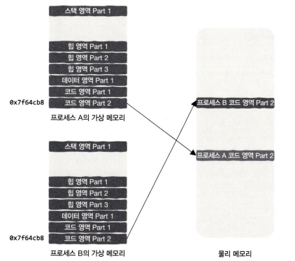
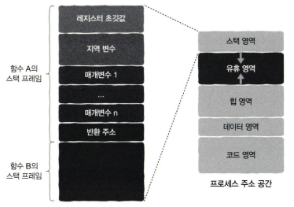
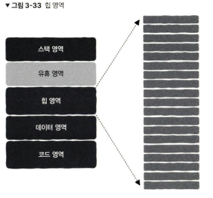
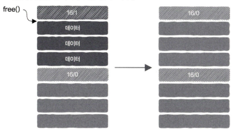
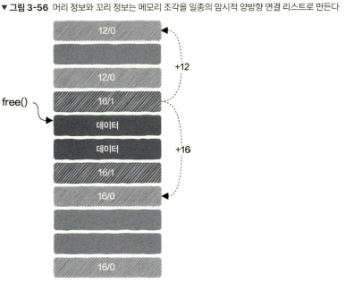

# 3장 저수준 계층? 메모리라는 사물함에서부터 시작해 보자! (3.1 ~ 3.4 - 196p ~ 247p)

# 3.1 메모리의 본질, 포인터와 참조

> 메모리가 무엇인가? 메모리의 파생된 개념들

메모리
사물함(메모리 셀) 같은 느낌? -> 하나의 메모리 셀 안에는 0과 1(1비트)만 보관 가능

바이트(byte) -> 이 1비트를 8개 묶어 정보를 나타내는 단위

서로 다른 정보 3개를 표현하려면 12바이트가 필요한데 이걸 사용해서 정보를 조합하여 표시하는 것을 프로그래밍 언어에서 
구조체(structure), 객체(object)로 표현함함

변수(variable)
메모리 주소, 실제 값을 하나의 정보로 감싼 느낌으로 생각하면 된다. 

포인터(pointer)
메모리 주소를 저장하는게 가능함 -> 메모리 주소를 더 높은 수준으로 추상화 한 것이다.
구체적인 메모리 주소를 얻는게 가능함
간접 주소 지정(indirect addressing) : 변수가 실제 데이터의 값이 아닌, 데이터가 저장된 메모리 주소를 저장하는 방식

참조(reference) : 포인터 대신 사용할 수 있도록 포인터를 한 번 더 추상화한 방식 어떤 변수를 참조한다.
대신 포인터 처럼 구체적인 메모리 주소를 얻을 수 없고, 포인터와 유사한 구조의 산술 연산이 불가능함
데이터를 복사할 필요가 없기 때문에 포인터를 사용할 때와 동일한 효과를 얻을 수 있음

# 3.2 프로세스는 메모리 안에서 어떤 모습을 하고 있을까?

메모리의 모든 프로세스는 이런 모습을 하고 있음

모든 프로세스의 코드 영역이 0x400000에서 시작함
그럼 서로 다른 프로세스 2개가 메모리 할당을 위해 malloc 함수를 호출하면 둘다 동일한 시작 주소를 반환할 가능성이 매우 높은데 이게 문제가 되지 않는가?
-> 그 메모리 주소는 가상 메모리 주소이기에 전혀 문제 되지 않고 메모리에 조작이 일어나기 전에 실제 물리 메모리 주소로 변경이 된다.
 
 프로세스들이 실제 물리 메모리에서 보여 주는 모습은 밑 그림에 가깝다.

 

 주목할만한 2가지 사항
 1. 프로세스는 동일한 크기의 '청크'로 나뉘어 물리 메모리에 저장됨, 이 프로세스 힙 영역은 동일한 크기의 조각 3개로 나뉘어있음 (그림에서)
 2. 모든 조각은 물리 메모리 전체에 무작위로 흩어져 있음

 가상 메모리와 물리 메모리 사이의 mapping 관계만 유지하면 OS가 프로세스에 균일한 가상 주소 공간을 제공하는 걸 방해하지 않는다.
 -> 페이지 테이블이 존재하는 이유!

  

  위 그림에 가상 메모리와 물리 메모리의 매핑 관계가 화살표로 나타내는걸 알 수 있다.
또한 영역 마다 part가 나뉘어 있는데 프로세스의 주소 공간을 동일한 크기의 청크로 나누고 그 청크를 페이지라고 부른다.

페이지 단위의 매칭이 이루어 지기에 페이지 테이블이 가져야하는 항목 수 자체가 줄어든다.

밑의 그림을 보다시피 가상 메모리 주소가 같이도 각자 가르키는 물리 메모리 주소가 다르기 때문에 동일한 메모리 주소에 기록해도 문제가 발생하지 않는 것이다!
  

# 3.3 스택 영역 : 함수 호출은 어떻게 구현될까?

스택의 진행 과정 : 후입선출!!!! (LIFO) / 궤적 자체가 이진 트리의 탐색과 같음

모든 함수는 실행 시 자신만의 상자 즉, 스택 프레임(stack frame) 또는 호출 스택(call stack)이라고 하는 것이 필요함

프로세스 스택 영역의 높은 주소가 맨 위에 있고 스택 영역은 낮은 주소 방향으로 커진다?

비유로 이해해보자!
스마트폰 사진첩 비유:

사진첩 (프로세스 스택 영역): 스마트폰에 저장된 사진들을 모아둔 앱입니다.

사진 (데이터): 스택에 저장되는 데이터 (함수 호출 정보, 지역 변수 등)

최신 사진 (높은 주소 = 스택의 맨 위): 가장 최근에 찍은 사진은 사진첩에서 가장 "위에" 보입니다. 이 사진이 스택의 "높은 주소"에 해당합니다.

오래된 사진 (낮은 주소): 예전에 찍은 사진들은 스크롤을 아래로 내려야 볼 수 있습니다. 이 사진들이 스택의 "낮은 주소"에 해당합니다.

사진첩이 커진다 (스택 영역은 낮은 주소 방향으로 커진다): 사진을 계속 찍으면 사진첩에 사진이 점점 더 많이 저장됩니다. 사진첩이 "커진다"는 것은 새로운 사진들이 예전 사진들 "아래"에 쌓이는 것과 같습니다. 스택 영역도 마찬가지로 새로운 데이터가 낮은 주소 방향으로 확장되면서 "커집니다".

핵심:

사진첩의 "맨 위" (최신 사진)은 스택의 "높은 주소"입니다.

사진첩이 "커진다"는 것은 새로운 사진들이 "아래"로 쌓이는 것과 같이, 스택 영역이 낮은 주소 방향으로 확장되는 것을 의미합니다.

요약:

사진첩 앱을 생각해보세요. 가장 최근에 찍은 사진이 "맨 위"에 있고, 사진을 계속 찍으면 사진첩이 아래로 "커지는" 것과 같습니다. 스택도 마찬가지로, 가장 최근에 저장된 데이터가 높은 주소에 있고, 스택이 확장될수록 낮은 주소 방향으로 커집니다.

 

함수가 어디서 어떤걸 호출했는지의 정보를 어떻게 획득하고 유지할까?
-> 스택 프레임의 도움이 필요함!
각 함수 호출마다 스택에 스택 프레임이 생성되며, 이 스택 프레임은 반환 주소, FP(이전 스택 프레임의 프레임 포인터를 가리키는 포인터), 매개변수, 지역 변수 등의 정보를 저장

이렇게 많은 것들을 스택에 저장하려고 해서 스택 영역 크기 제한을 넘어서면 스택 오버플로우 오류가 발생한다!!

그래서 다음과 같은 걸 주의해야하는데
1. 너무 큰 지역 변수를 만들지 않기
2. 함수 호출 단계가 너무 많으면 안됨

# 3.4 힙 영역 : 메모리의 동적 할당은 어떻게 구현될까?

함수의 호출 횟수와 관계없이 프로그래머가 해당 메모리 영역의 사용이 완료 되었다고 확신할 때까지 유효하게 유지가되는 메모리가 필요함
프로그래머가 메모리 수명 주기를 완전히 직접 제어할 수 있는 매우 큰 메모리 영역이 필요한데 그 영역을 힙 영역 이라고 한다.

힙 영역은 생각보다 매우 간단한 구조로 되어 있다.

메모리를 요청할 때 메모리에서 적절한 크기의 여유 메모리를 찾아야 하는데 어떤 메모리가 여유 메모리이고 이미 할당 되어있는지 아는 방법?

메타데이터 블록 (Metadata Block) 또는 헤더 (Header):

각 메모리 블록 (할당되었거나 여유로운 블록) 앞에는 작은 크기의 메타데이터 블록 (또는 헤더)이 위치합니다.

이 메타데이터 블록에는 해당 메모리 블록의 크기, 할당 여부 (allocated/free), 이전/다음 블록에 대한 포인터 등의 정보가 저장됩니다.

힙 메모리 관리자는 이 메타데이터 블록을 사용하여 각 메모리 블록의 상태를 파악합니다.

여유 리스트 (Free List):

힙 메모리 관리자는 여유 메모리 블록들을 연결 리스트 형태로 관리합니다. 이 연결 리스트를 "여유 리스트"라고 부릅니다.

여유 리스트의 각 노드는 여유 메모리 블록을 가리키며, 다음 여유 블록에 대한 포인터를 가지고 있습니다.

메모리를 요청할 때, 힙 메모리 관리자는 여유 리스트에서 적절한 크기의 블록을 찾습니다.

블록이 할당되면 여유 리스트에서 제거되고, 메모리가 해제되면 다시 여유 리스트에 추가됩니다.

비트맵 (Bitmap):

힙 영역을 작은 단위 (예: 8바이트)로 나누고, 각 단위에 해당하는 비트를 할당합니다.

각 비트는 해당 단위가 할당되었는지 (1) 또는 여유로운지 (0)를 나타냅니다.

메모리를 요청할 때, 힙 메모리 관리자는 비트맵을 검색하여 연속된 여유 단위를 찾습니다.

비트맵은 메모리 사용량을 간결하게 표현할 수 있지만, 큰 힙 영역에서는 비트맵 자체의 크기가 커질 수 있습니다.

경계 태그 (Boundary Tag):

각 메모리 블록의 시작과 끝에 블록의 크기와 할당 여부를 나타내는 태그를 저장합니다.

이를 통해 인접한 블록이 여유로운지 확인할 수 있으며, 메모리 해제 시 인접한 여유 블록들을 병합(coalescing)하여 더 큰 여유 블록을 만들 수 있습니다.

 

어떻게 여유 메모리 조각을 선택하는가?
1. 최초 적합 방식 : 여유 리스트의 처음부터 검색하여 요청한 크기 이상의 첫 번째 여유 메모리 블록을 선택
2. 다음 적합 방식 : 이전 할당 시 검색했던 위치부터 검색을 시작하여 요청한 크기 이상의 첫 번째 여유 메모리 블록을 선택
3. 최적 적합 방식 : 유 리스트 전체를 검색하여 요청한 크기 이상의 가장 작은 여유 메모리 블록을 선택

그 밖에도 최악 적합, 퀵 리스트, 분리 적합 등의 방식이 존재함

메모리 할당 방법
메모리 조각을 요청하는데 너무 큰 메모리 조각을 전부 할당하면 메모리 낭비 및 내부 단편화가 발생하게 되는 경우가 생김
따라서 여유 메모리 조각을 분할해서 할당하고 남은 부분은 전보다 분할된 작은 크기의 새로운 여유 메모리 조각으로 만드는 방법이 있음

메모리 해체
메모리 해체를 단순히 하게 되면 다음 그림과 같은 경우가 발생함

16, 16 메모리 바이트로 나뉘어서 그대로 두면 16을 넘어선 할당 요청이 올때 요청을 받지 못하게됨
따라서 인접한 메모리 조각이 비어 있다면 더 큰 메모리 조각으로 서로 병합하는게 더 나은 접근 방식임
그럼 이 병합 시기를 즉시하는가? 요청이 올때 하는가?

즉시 매번 하게되면 매우 부담이 발생하게 될 것임, 따라서 대부분 여유 메모리 조각 병합을 연기시키는 전략을 사용함

여유 메모리 조각을 효율적으로 병합하는 방법
메모리 조각 끝에 footer를 추가해서 이 footer 정보를 통해서 인접한 여유 조각을 빠르게 병합이 가능함

header 정보와 footer 정보는 메모리 조각을 일종의 암시적 양방향 연결 리스트로 만들게 됨

