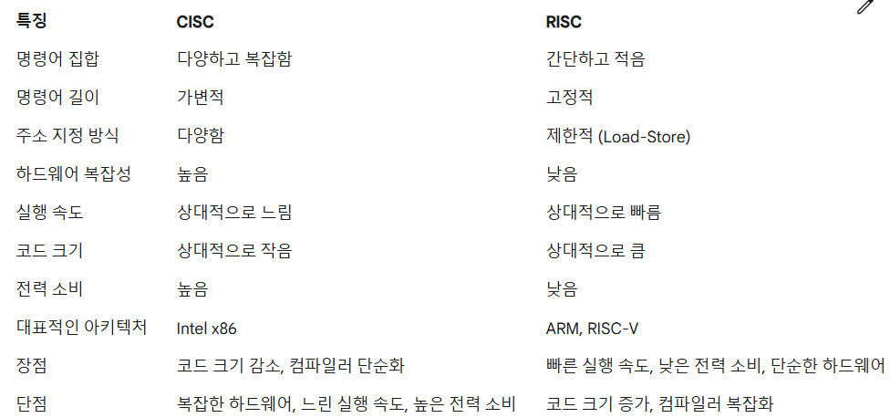

# 4장 트랜지스터에서 CPU로 이보다 더 중요한 것은 없다. (1) 4.6 ~ 4.10 320p~359p

## 4.6 CPU 진화론 (상) : 복잡 명령어 집합의 탄생

어떤 프로그램이든 (복잡하든 간단하든) 결국 CPU 입장에서는 명령어의 개수 차이일 뿐 결국 컴파일러로 간단한 기계 명령어로 변환하기 때문에 실행 파일에 저장되어 CPU가 메모리에서 그 명령어를 읽어 실행하기만 하면 됩니다.

명령어 집합은 우리에게 CPU가 할 수 있는 일을 알려 줍니다. 
-> 프로그래머가 프로그래밍에 사용을 하게 됨

명령어 집합 유형은 프로그래머가 코드를 작성할 때뿐만 아니라 CPU의 하드웨어 설계에도 영향이 있음

오늘날 컴퓨터는 기본적으로 폰 노이만 구조를 띄고 있음, 이 구조의 핵심은 '저장 개념에서 프로그램과 프로그램이 사용하는 데이터에 어떤 차이도 없어야 하며, 모두 컴퓨터의 저장 장치 안에 저장될 수 있어야 한다'입니다.

근데 결국 프로그래머가 작성한 코드가 디스크 저장 공간을 차지하고, 실행 시에는 메모리에 적재되기에 메모리 저장 공간을 차지함

옛날 메모리 칩의 용량은 몇 KB 정도 밖에 되지 않았기에 이렇게 작은 메모리에 더 많은 프로그램을 적재하려면 기계 명령어를 매우 세밀하게 설계해서 프로그램이 차지하는 저장 공간을 줄여야 했음.
- 많은 것을 포함하는 하나의 단일 명령어
- 기계 명령어의 길이가 가변적
- 기계 명령어는 밀도를 높여 공간을 절약하기 위해 고도로 인코딩

명령어 집합의 변경에 대응하기 위해 하드웨어를 변경하는 것이 번거롭기 떄문에 소프트웨어적인 발상으로 변경한 방법 -> 마이크로코드

마이크로코드를 사용해도 결국 버그를 나타내고 버그를 수정하는게 어려움
또한 설계 단계에서 트랜지스터를 매우 많이 소모함

## 4.7 CPU 진화론(중): 축소 명령어 집합의 탄생
결국 위 내용 처럼 복잡 명령어 집합의 출현은 더 많은 경우 아직 초보 단계였던 컴파일러와 저장 장치의 용량 제한샅은 객관적인 조건으로 제한을 받았음
하지만 메모리 발전 및 가격 저하로 인해 어셈블리어로 코드를 작성하는 방식이 더 이상 의미가 없어짐 그로 인해 복잡 명령어 대신 축소 명령어 집합의 철학이 탄생함

축소 명령어 집합

1. 명령어 자체의 복잡성
- 복잡한 명령어를 제거하고 간단 명령어 여러 개로 대체
- 연산량을 줄이는 것
2. 컴파일러
- CPU에 대해 더 강력한 제어권을 갖게됨
- 축소 명령어 집합을 '흥미로운 작업을 컴파일러에 떠넘기기'라고 부르기도 함
3. LOAD/STORE 구조
- 복잡 명령어 집합에서는 기계 명령어 하나만으로 메모리에서 데이터를 가져와(IF) 작업을 수행하고(EX), 다시 메모리에 쓰는 것(WB)이 가능하지만, 축소 명령어 집합에서는 이를 금지하게 함
- 레지스터 내 데이터만 처리가 가능하며, 메모리 내 데이터는 직접 처리 불가
- 데이터를 가져오기 위해 LOAD/STORE 라는 전용 기계 명령어가 메모리의 읽고 쓰기를 책임짐

복잡 명령어, 축소 명령어의 명령어 작업 비교

복잡 명령어
- 가능한 적은 수의 기계 명령어로 가능한 많은 작업 수행 
- 하지만 이 명령어 연산 자체는 복잡함
- 고급 언어와 비슷하며 고급 언어 <-> 기계 명령어 차이를 줄임

축소 명령어
- 간단한 명령어 여러 개 사용해서 작업 완료함
- 하나 하나 명령어 연산 자체가 최대한 쉽게
- 더 많은 저장 공간이 필요함

명령어 파이프라인

파이프라인 기술은 기계 명령어 하나가 실행되는 시간을 단축해 주지는 않는다.
하지만 처리량을 늘릴 수 있기에 모든 명령어의 실행 시간을 대체적으로 동일하게 하여 파이프라인으로 효율을 높일 수 있음

복잡 명령어 집합에서는 명령어 사이의 차이에서 크기와 실행시간이 비례하지 않기에 파이프라인 방식을 제대로 활용하기에는 부적합

축소 명령어 집합은 더 많은 명령어를 필요로 하지만 마이크로코드가 없기 때문에 더 적은 트랜지스터를 필요로 함

## 4.8 CPU 진화론(하): 절체절명의 위기에서 반격
이미 팔려나간 많은 칩들을 생각하며 복잡 명령어 집합의 명령어를 CPU 내부에서 축소 명령어 집합으로 변경하는 방식인 마이크로 명령어가 탄생함

하이퍼스레딩(hyper-threading)
하나의 물리적인 CPU 코어가 마치 두 개의 논리적인 코어처럼 작동하도록 만들어줍니다. 이를 통해 CPU의 활용률을 높이고, 전반적인 시스템 성능을 향상시킬 수 있습니다.

CISC VS RISC

## 4.9 CPU, 스택과 함수 호출, 시스템 호출, 스레드 전환, 인터럽트 처리 통달하기

레지스터
CPU가 레지스터가 필요한 이유 -> 속도
레지스터와 메모리는 본질적인 차이가 없고 둘 다 정보 저장에 사용 됨
-> 레지스터가 속도, 비용 모두 높기때문에 나누는 것

스택 포인터
스택의 가장 중요한 정보가 스택 상단이고, 이 스택 상단 정보는 스택 하단을 가리키는 스택 포인터에 저장됨

스택 프레임
함수가 실행될 때 함수에 정의된 로컬 변수와 전달된 매개변수 등을 저장하는 독립적인 메모리 공간
함수 호출 단계에 따라 스택 프레임 수 증가
함수 호출 완료시 반대 순서로 스택 프레임 수가 줄어듬

명령어 주소 레지스터(PC)
프로그램이 실행되면 첫 번째로 실행할 기계 명령어의 주소가 PC 레지스터에 저장되며, CPU는 이 PC 레지스터에 저장되어 있는 주소에 따라 메모리에서 명령어를 가져와 실행
PC 레지스터 값은 순차적으로 증가함

상태 레지스터
산술 연산 중 발생한 플래그(자리올림, 오버플로우 등)를 저장.
CPU가 사용자 모드인지 커널 모드인지도 상태 레지스터를 통해 구분함

상황 정보 (Context)
현재 CPU의 레지스터 상태 전체를 상황 정보(Context)라고 함.
함수 호출, 시스템 콜, 스레드 전환, 인터럽트 등으로 인해 흐름이 중단되므로 복귀를 위해 저장이 필요.
상황 정보는 스택 프레임에 저장되며, 복귀 시 복원됨.

중첩과 스택
함수/시스템 콜/인터럽트 등 중첩 호출을 관리하기 위해 스택 구조가 사용됨.
하드웨어/소프트웨어 모두 구현 가능.

시스템 콜과 커널 스택
응용 프로그램은 시스템 콜을 통해 OS에 요청
커널 내부 함수도 함수이므로 실행을 위해 커널 모드 스택을 사용
사용자 스레드는 커널 스택과 매핑되며, 레지스터 등 상황 정보가 커널 스택에 저장됨

인터럽트와 인터럽트 함수 스택
외부 장치가 CPU에 인터럽트를 발생시키면, 현재 흐름을 멈추고 인터럽트 핸들러로 이동
인터럽트 핸들러도 함수이므로 실행 시간 스택 필요
커널 스택 또는 각 CPU별 전용 인터럽트 스택 사용

스레드 전환과 커널 상태 스택
리눅스에서는 각 스레드마다 task_struct 구조체가 존재하고, 그 안의 thread_struct에 CPU 상황 정보가 저장됨
스레드 전환 시 현재 스레드의 context를 저장하고, 새로운 스레드의 context를 복원함

